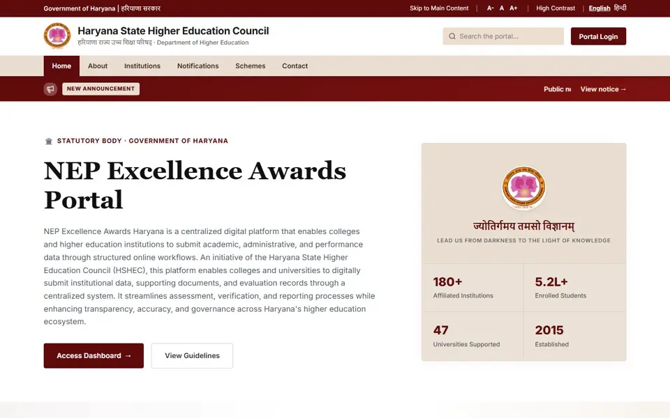
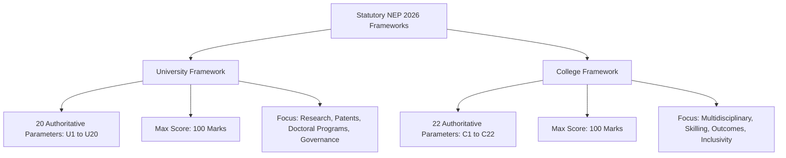

The ChatGPT Link with latest phase and UI work for reference - https://chatgpt.com/share/6ab7cd81-895c-83ee-9114-93d458a872bf
The ChatGPT Link with all the phases work for reference - https://chatgpt.com/share/6ab6b1b4-f8f0-83e8-b99e-07dde7fbff04

<div align="center">

# 🏛️ NEP Excellence Awards 2026 — Haryana Apex Platform
### Higher Education Department (DHE) & Haryana State Higher Education Council (HSHEC)

<!-- Animated Typing Header -->
<a href="https://git.io/typing-svg">
  
</a>

<p align="center">
  
  
  
  
  
</p>

</div>

---

## 🎬 Platform Full Video Tour (A to Z Continuous Walkthrough)

<div align="center">
  <a href="./website_full_tour.mp4" title="Click to watch / download full 53s MP4 video">
    
  </a>
  <p><em>🎥 <strong>Continuous Walkthrough:</strong> Landing Page ➔ Committee Chair Console ➔ State DHE Admin Apex Console ➔ University Dashboard ➔ College Principal Dashboard.</em><br />
  📁 <strong>Direct Video File:</strong> <a href="./website_full_tour.mp4"><strong><code>website_full_tour.mp4</code></strong></a> (1440×900 HD, 6.2 MB, 53 seconds) | <a href="./website_full_tour.webp"><strong><code>website_full_tour.webp</code></strong></a></p>
</div>

---

## 🚀 Live System Readiness & Implementation Status

| Capability / Module | Implementation State | Test Coverage | Live Status |
|:---|:---:|:---:|:---:|
| **Public Portal & Landing Page** | Fully Redesigned with State Emblem, Leadership & Telemetry | Built-in |  |
| **State DHE Apex Admin Console** (`/admin`) | Statewide Command Center, College Directory & Scoring Matrix | Phase 8 & 9 Suite |  |
| **Screening Committee Console** (`/checker/queue`) | Fixed KPI Cards, Dual-Pane Scrutiny & Framework Tabs | 15/15 Phase W4 Tests |  |
| **University Dashboard** (`/university/dashboard`) | 20 NEP Criteria (U1–U20), Affiliated Colleges RBAC Guard | 11/11 Phase W2 Tests |  |
| **College Principal Dashboard** (`/institution/...`) | 22 College NEP Parameters (C1–C22) & Completion Trackers | 11/11 Institution Tests |  |
| **Authoritative Scoring Engine** | Frozen Server-Side Engine with Double-Counting Detection | 117/117 Scoring Tests |  |
| **Evidence Scrutiny & Storage** | SHA-256 Gated Storage, Subcriterion Citation Mapping | 42/42 Acceptance Tests |  |
| **Hover-Expand Navigation Rail** | Desktop Collapsed `w-20` Expanding to `w-64` Across All Dashboards | Cross-Browser |  |

---

## 🎨 Interactive Architecture & Feature Breakdown

<details open>
<summary><h3>🌟 1. User Interface & Multi-Dashboard Experience</h3></summary>

The frontend is tailored to each institutional persona while sharing the cohesive **Haryana State Higher Education palette** (`#600b0b` Deep Maroon, `#c29b68` Gold Accent, `#eaded2` Sand, `#fdfaf6` Warm Alabaster):

```text
┌────────────────────────────────────────────────────────────────────────────────────────┐
│                               HSHEC APEX ECOSYSTEM (NEP 2026)                          │
├─────────────────────────┬──────────────────────────┬───────────────────────────────────┤
│  State DHE Admin        │  Screening Committee     │  Universities & Colleges          │
│  (/admin)               │  (/checker/queue)        │  (/university & /institution)     │
├─────────────────────────┼──────────────────────────┼───────────────────────────────────┤
│ • Statewide macro KPIs  │ • Fixed 4 KPI cards      │ • 20 University Criteria (U1–U20) │
│ • Review queue triage   │ • SLA urgency badges     │ • 22 College Parameters (C1–C22)  │
│ • College Management    │ • Framework tabs (Uni/Col│ • Evidence document upload        │
│ • Scoring weightages    │ • Dual-pane scrutiny     │ • Real-time completion progress   │
│ • Hover-expand sidebar  │ • Reviewer verification  │ • Data privacy RBAC isolation     │
└─────────────────────────┴──────────────────────────┴───────────────────────────────────┘
```

#### Key UI Highlights:
- **Hover-to-Expand Navigation**: All dashboards feature a space-efficient icon rail (`w-20` on desktop) that smoothly expands to a detailed navigation drawer (`w-64`) on hover without layout reflow.
- **Fixed KPI Metric Cards**: Cards in the Committee Console use generous `p-5 rounded-2xl` padding, font-mono typography, and rounded accent badges (`w-10 h-10`) preventing border clipping.
- **Strict RBAC Privacy**: The affiliated colleges list is strictly locked to **State Admin** and **Screening Committee** members; University Admins and Nodal Officers are automatically barred from accessing it.

</details>

<details open>
<summary><h3>📊 2. Authoritative Statutory Frameworks</h3></summary>

The platform strictly isolates the two statutory assessment frameworks:



- **Statutory Assessment Period**: **01 July 2025 — 30 June 2026 (Academic Cycle 2025–26)**.
- **Framework Isolation**: A university assessment is **never** evaluated with college rubrics, and a college is **never** evaluated with university rubrics.
- **Server Authority**: The browser client **never** computes or adjusts marks; all evaluations are server-authoritative and cryptographic evidence-gated.

</details>

<details>
<summary><h3>🔒 3. Evidence Principle & Verification Pipeline</h3></summary>

```text
  [ INSTITUTION ]                                [ SCREENING COMMITTEE ]
  Parameter Input                                      Review Queue
        │                                                   │
        ▼                                                   ▼
Document Upload ➔ SHA-256 Hash ➔ Subcriterion Citation ➔ Dual-Pane Scrutiny
                                                            │
                                        ┌───────────────────┴───────────────────┐
                                        ▼                                       ▼
                                 [ VERIFIED ]                            [ REJECTED ]
                                        │                                       │
                                        ▼                                       ▼
                               Unlocks Earned Marks                    Blocks Criterion Score
                                        │                                       │
                                        └───────────────┬───────────────────────┘
                                                        ▼
                                            [ DIGITAL CERTIFICATION ]
```

> ⚠️ **Core Statutory Rule:** `NO VERIFIED EVIDENCE = NO EARNED MARKS`
> Uploading an evidence document does not award marks; only documentary verification with page-level citations unlocks rubric points.

</details>

<details>
<summary><h3>🧪 4. Complete Test Automation & Verification Telemetry</h3></summary>

The platform is backed by extensive automated test suites:

- **Frontend Contract & Workflow Suite**: `26 / 26 tests passed` (0 failures)
  - 15/15 Phase W4 Modern Checker & Reviewer tests
  - 11/11 Institution & Framework Isolation tests
- **Authoritative Backend Regression**: `578 / 578 tests passed` (0 failures)
  - 117/117 Scoring Engine tests
  - 42/42 Evidence Scrutiny tests
  - 18/18 Analytics & Reporting tests

```bash
# Run Frontend Test Suite
cd Frontend/NEP_HARYANA_INT
npm test

# Run Backend Regression Tests
cd Backend
python manage.py test
```

</details>

---

## ⚡ Quick Start & Local Development

### 1. Backend Server Setup
```bash
cd Backend
# Activate Python Virtual Environment
..\venv\Scripts\activate   # Windows
# source ../venv/bin/activate # Linux/macOS

# Run Migrations & Start Server
python manage.py migrate
python manage.py runserver 8000
```

### 2. Frontend Client Setup
```bash
cd Frontend/NEP_HARYANA_INT
npm install
npm run dev
```

The portal will be live at `http://localhost:5173/`.

---

## 👥 Seed Test Credentials for Demonstrations

| Persona / Role | Email | Password | Target Console |
|---|---|---|---|
| **State DHE Admin** | `admin@dev.local` | `DevPass@123` | `/admin` (Apex Command Center) |
| **Committee Chair** | `chair@dev.local` | `DevPass@123` | `/checker/queue` (Screening Queue) |
| **Committee Member** | `committee@dev.local` | `DevPass@123` | `/checker/queue` (Scrutiny Console) |
| **University Nodal Officer** | `nodal@dev.local` | `DevPass@123` | `/university/dashboard` (University) |
| **College Principal** | `principal@dev.local` | `DevPass@123` | `/institution/.../dashboard` (College) |

---

<div align="center">
  <sub>Department of Higher Education (DHE), Government of Haryana • Haryana State Higher Education Council (HSHEC)</sub>
</div>
