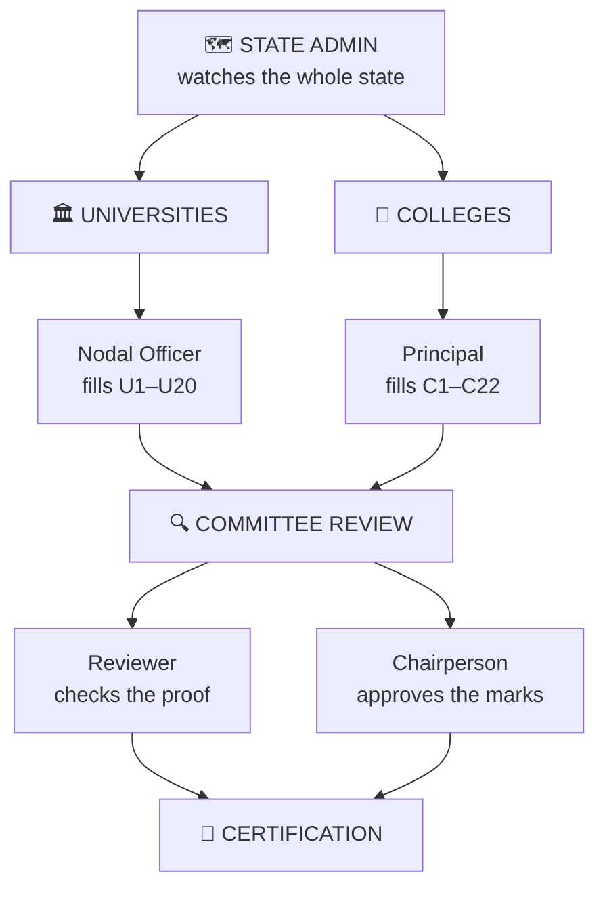
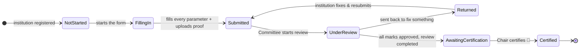
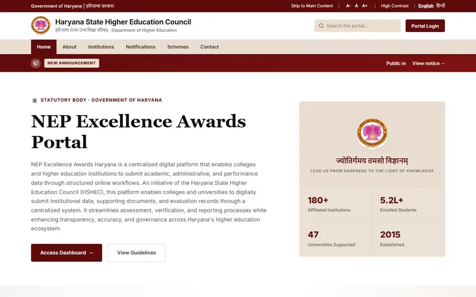

The ChatGPT Link with all the work - https://chatgpt.com/share/6ab7cd81-895c-83ee-9114-93d458a872bf

<div align="center">

# 🏛️ NEP Excellence Awards 2026 — Haryana

### Higher Education Department (DHE) & Haryana State Higher Education Council (HSHEC)

<a href="https://git.io/typing-svg">
  
</a>

<p>
  
  
  
  
</p>

</div>

---

## 🤔 What is this, in one minute?

Haryana gives **NEP Excellence Awards** to its universities and colleges. This website runs the whole process online:

1. 🏫 **A college or university fills in a form** about what it did in the year (**1 July 2025 – 30 June 2026**).
2. 📎 **It uploads proof** (PDFs) for each thing it claims.
3. 🔍 **The Screening Committee checks the proof.** No checked proof = no marks.
4. ✅ **The Committee Chair approves the marks and certifies the result.**
5. 🗺️ **The State Admin watches everything** — who has started, who is stuck, who is certified — and can pull reports.

The computer, not a person, calculates the marks from the rules. People can only **check**, **approve**, or **adjust with a written reason** — and every action is saved in an audit log.

---

## 🧭 Who does what


```mermaid
flowchart TD
    SA["🗺️ STATE ADMIN<br/>watches the whole state"]
    SA --> U["🏛️ UNIVERSITIES"]
    SA --> C["🏫 COLLEGES"]
    U --> NO["Nodal Officer<br/>fills U1–U20"]
    C --> P["Principal<br/>fills C1–C22"]
    NO --> CR["🔍 COMMITTEE REVIEW"]
    P --> CR
    CR --> R["Reviewer<br/>checks the proof"]
    CR --> CH["Chairperson<br/>approves the marks"]
    R --> CERT["🏅 CERTIFICATION"]
    CH --> CERT
```

| Role | In one line | Where they work |
|---|---|---|
| 🏫 **College Principal** | "I complete my college's assessment (C1–C22)." | `/institution/.../dashboard` |
| 🏛️ **University Nodal Officer** | "I complete my university's assessment (U1–U20)." | `/university` |
| 🔍 **Committee Reviewer** | "I check the proof and review the assessment." | `/checker/queue` |
| ⚖️ **Committee Chairperson** | "I finalise the committee's decision and certify." | `/checker/queue` |
| 🗺️ **State Admin** | "I control and monitor the entire state's process." | `/admin` |

### 🗺️ What the State Admin can and cannot do

The State Admin is the **eye on the whole state**, not a super-reviewer.

| ✅ Can | ❌ Should not |
|---|---|
| See **every** university and college, even ones that have not started | Fill in an institution's form |
| See each one's stage: *Not Started → Filling In → Submitted → Under Review → Awaiting Certification → Certified* (or *Returned*) | Approve or reject evidence (Committee's job) |
| Open any assessment in **read-only** mode | Accept or change marks (Committee's job) |
| Assign or reassign a reviewer (a reason is required when reassigning) | Quietly edit scores outside the workflow |
| See committee workload: pending reviews, unassigned ones, open work per reviewer | Certify an assessment — only the Committee Chair can (the server enforces this) |
| Download a CSV of institutions and pull state reports | |
| Read the recent audit trail (who did what, and when) | |

**Admin console pages**

| Page | What you see |
|---|---|
| **Overview** (`/admin`) | State totals · a *Needs Attention* list (not started, submitted without a reviewer, returned, waiting for the Chair) · committee workload · latest scores · recent activity |
| **Institutions** (`/admin/institutions`) | Every university and college in one table. Filter by type (University / College) and stage, search by name / AISHE code / email, export CSV. Click a row to open its assessment. |
| **Reports** (`/admin/reports`) | State-level and institution-level reports |

---

## 🔄 The workflow, step by step


```mermaid
stateDiagram-v2
    direction LR
    [*] --> NotStarted: institution registered
    NotStarted --> FillingIn: starts the form
    FillingIn --> Submitted: fills every parameter + uploads proof
    Submitted --> UnderReview: Committee starts review
    UnderReview --> Returned: sent back to fix something
    Returned --> Submitted: institution fixes & resubmits
    UnderReview --> AwaitingCertification: all marks approved, review completed
    AwaitingCertification --> Certified: Chair certifies 🏅
    Certified --> [*]
```

**1 · Fill in (Principal / Nodal Officer)**
Open the dashboard → start the 2025-26 assessment → fill each parameter. The system checks your numbers before it accepts a submission (for example, "students placed" cannot be more than "students who took part").

**2 · Upload proof**
Each part of a parameter asks for a specific document. Upload a PDF against that part. Uploading alone gives **no** marks — it only makes the claim checkable.

**3 · Submit**
When every parameter is filled, press **Submit**. The form locks.

**4 · Committee review (Reviewer)**
Open the queue → **Start Review** → look at each document next to the claim → **Verify** or **Reject** it (a reason is required). Verified proof unlocks the marks for that part.

**5 · Approve marks (Chairperson)**
For each parameter, **Accept** the calculated score, or **Adjust** it with a written reason. If something is wrong, **Return for Correction** instead — the institution gets it back to fix.

**6 · Certify (Chairperson)**
Once every parameter is approved: **Complete Review → Award → Certify**. Certification is final and cannot be undone.

**7 · Watch (State Admin)**
Throughout, the State Admin sees every institution's stage, who is stuck, and who has been certified.

> ⚠️ **Golden rule:** `NO VERIFIED PROOF = NO MARKS`. The browser never calculates marks — the server does, from the official rubric.

---

## 📐 The two rulebooks

| | 🏛️ University | 🏫 College |
|---|---|---|
| Parameters | **U1 – U20** | **C1 – C22** |
| Maximum | 100 marks | 100 marks |
| Filled by | Nodal Officer | Principal |

A university is never marked with the college rules, and a college is never marked with the university rules.

---

## ⚡ Run it on your computer

**1. Backend (Django, port 8000)**
```bash
cd Backend
..\venv\Scripts\activate          # Windows
# source ../venv/bin/activate     # Linux / macOS
python manage.py migrate
python manage.py create_dev_users  # creates the staff logins below
python manage.py runserver 8000
```

**2. Frontend (React, port 5173)**
```bash
cd Frontend/NEP_HARYANA_INT
npm install
npm run dev
```

Or start both at once from the repo root: `npm run dev`.
Open **http://localhost:5173**.

---

## 🧪 Demo data — try the whole flow

`demo_tools/seed_demo.py` creates **5 colleges and 3 universities**, each stopped at a different step, so you can test every role right away. It uses the real API, so the backend must be running.

```bash
# from the repo root, with the backend running on :8000
venv\Scripts\python.exe demo_tools\wipe_institutions.py           # ⚠️ deletes ALL institutions, assessments and uploads (dev only)
set PYTHONPATH=demo_tools && venv\Scripts\python.exe demo_tools\seed_demo.py
```

**Staff logins**

| Role | Email | Password |
|---|---|---|
| 🗺️ State Admin | `admin@dev.local` | `DevAdmin@123` |
| 🔍 Committee Reviewer | `committee@dev.local` | `DevCommittee@123` |
| ⚖️ Committee Chair | `chair@dev.local` | `DevChair@123` |

**Institution logins** (password for all: `Demo@1234`)

| Institution | Login | Where it is stopped | What to try |
|---|---|---|---|
| Govt. College, Sector 9, Gurugram | `principal.gurugram@demo.local` | Not started | Fill the form from scratch |
| Dayanand College, Hisar | `principal.hisar@demo.local` | Filled + proof uploaded | Press **Submit** |
| Govt. College for Women, Rohtak | `principal.rohtak@demo.local` | Submitted | Committee: start review, verify proof |
| Hindu College, Sonepat | `principal.sonepat@demo.local` | Under review, proof verified | Chair: accept / adjust marks |
| Dyal Singh College, Karnal | `principal.karnal@demo.local` | All marks approved | Chair: **Complete → Award → Certify** |
| Kurukshetra University | `nodal.kuk@demo.local` | Not started | Fill U1–U20 from scratch |
| Maharshi Dayanand University, Rohtak | `nodal.mdu@demo.local` | Submitted | Committee review |
| Guru Jambheshwar University, Hisar | `nodal.gju@demo.local` | All marks approved | Chair: certify |

Log in as `admin@dev.local` at any point to watch them move through the stages.

---

## 🧰 Tests

```bash
# Backend
cd Backend
python manage.py test

# Frontend
cd Frontend/NEP_HARYANA_INT
npm test
```

---

## 🎬 Video tour

<div align="center">
  <a href="./website_full_tour.mp4">
    
  </a>
  <p><em>Recorded before the State Admin console redesign — the admin screens now look different.</em></p>
</div>

---

<div align="center">
  <sub>Department of Higher Education (DHE), Government of Haryana • Haryana State Higher Education Council (HSHEC)</sub>
</div>
